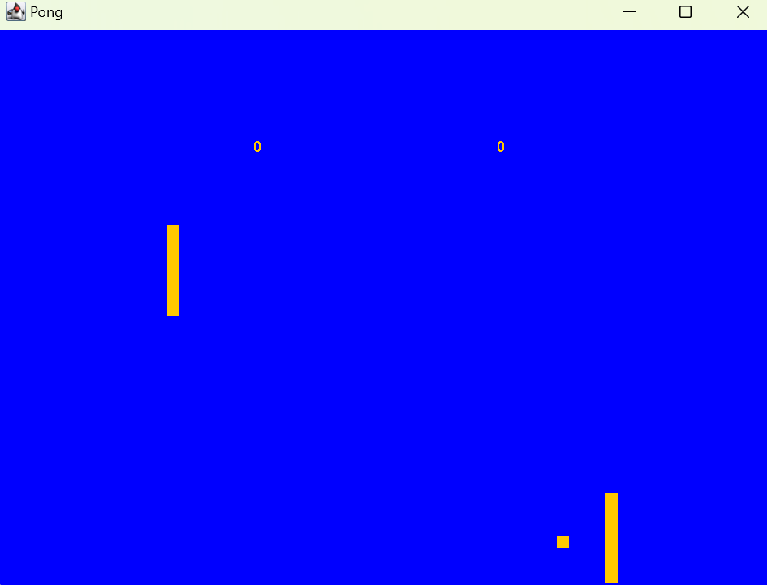

# Pong_Game
This is a basic pong game programmed in the java language against a CPU. It is a basic demonstration of my skills and familiarity with Object Oriented Programming and its principles. 

Technology used:
	-Java
	-Swing Library
	-Eclipse IDE
	-Event Listeners

#Screenshots and playthrough of one game

